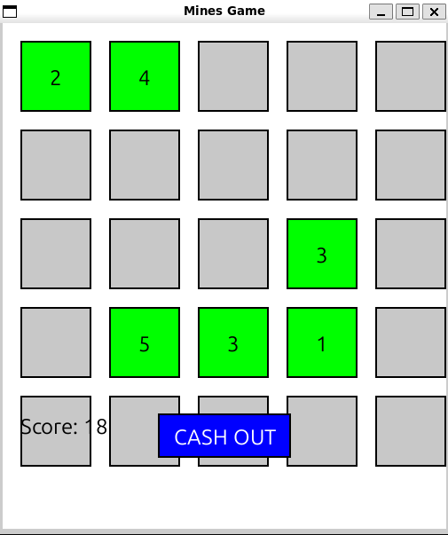
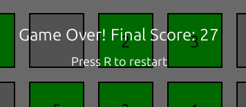
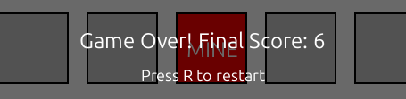

# 💣 Mines-Style Grid Game

A fun and strategic 5x5 minesweeper-inspired game built using **Python** and **Pygame**. Reveal tiles to earn points, avoid hidden mines, and decide when to “Cash Out” before it’s too late!

---

## 🎮 How to Play

- Click on a tile to reveal it
  - Safe tiles give **1–5 points**
  - Mines end the game instantly
- Click the **"Cash Out"** button to save your current score and end the game safely
- Press **`R`** to restart the game after it ends

---

## 🧠 Features

✅ 5x5 interactive grid  
✅ Random placement of **5 mines** each game  
✅ Safe tiles award **random points between 1 and 5**  
✅ "Cash Out" button to end game early and save score  
✅ Score display in real-time  
✅ Game over screen with final score  
✅ Option to **restart** game after finishing  
✅ Score saved to a **text file with timestamp**  
✅ Color-coded cells for **visual feedback**:
- 🟩 Green = Safe cell  
- 🟥 Red = Mine  

---

<!-- >  (\Screenshots\2.png) (\Screenshots\3.png)  -->
## 🖼️ Game Screenshots

<p align="center">
  
  
  
</p>
<br>
> _Green tiles are safe, red tile = mine, and score is shown at the top._

---

## 🛠️ Installation

### ✅ Prerequisites

- Python 3.x
- Pygame library

### 💻 Setup Instructions

```bash
# Clone the repository
git clone https://github.com/aryan1524in/Mine_game_Q.git
cd Mine_game_Q

# (Optional) Create a virtual environment
python3 -m venv venv
source venv/bin/activate  # For Windows: venv\Scripts\activate

# Install dependencies
pip install pygame

# Run the game
python mines_game.py
```

### Credits
Built by Aryan Singh
Developed with Q Developer using Python and Pygame.